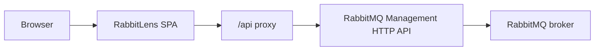

# RabbitLens

[](LICENSE)
[](https://react.dev/)
[](https://vite.dev/)
[](https://www.rabbitmq.com/docs/management)

RabbitLens is a replacement web UI for RabbitMQ Management. It keeps the proven RabbitMQ Management HTTP API and replaces the legacy browser experience with a cleaner, faster, more operator-friendly interface.

## Why RabbitLens?

RabbitMQ Management already exposes a powerful operational API, but the legacy UI can feel dated when you are managing busy brokers, tracing messages, comparing policies, or jumping between queues, channels, exchanges, and users.

RabbitLens focuses on:

- A polished dark/light interface that feels like a modern infrastructure product.
- Operational parity with RabbitMQ Management, not a small dashboard subset.
- Clearer read/write actions, safer destructive flows, and cleaner detail pages.
- English and Vietnamese localization.
- Direct use of RabbitMQ permissions, tags, and Management API capabilities.
- A lightweight deployment model that can sit in front of RabbitMQ Management.

## What RabbitLens is — and is not

RabbitLens replaces the Management UI, not RabbitMQ itself.



- RabbitMQ still needs the `rabbitmq_management` backend plugin enabled.
- RabbitLens uses the same Management API endpoints the legacy UI uses.
- RabbitMQ remains the source of truth for authentication, authorization, permissions, users, virtual hosts, policies, queues, exchanges, bindings, and messages.
- RabbitLens does not persist broker data or message payloads.

## Features

### Monitoring and topology

- Overview with cluster health, workload health, message totals, and node status.
- Nodes list and node detail pages.
- Connections list/detail with metrics, channels, endpoints, AMQP capabilities, and force-close actions.
- Channels list/detail with consumer and protocol diagnostics.
- Exchanges list/detail, publish message, binding management, and remove actions.
- Queues and streams list/detail with message counts, consumers, bindings, publish/get/move/purge/remove actions.
- Message inspector for explicit payload snapshots from queues.

### Administration

- Users, user detail, tags, permissions, topic permissions, and limits.
- Virtual hosts, metadata, scoped links, limits, and delete/edit flows.
- Policies and operator policies.
- Virtual host limits and user limits.
- Feature flags and deprecated features.
- Cluster settings and definition export/import.

### Extensions

- Federation status and upstreams.
- Dynamic shovels and shovel status.
- Stream connections and super streams.
- Top processes and ETS tables.
- Tracing, trace files, and trace cleanup.

### Product experience

- Dark, light, and system themes.
- English and Vietnamese UI.
- Reusable table, form, dialog, chart, badge, and detail components.
- Command-style navigation/search affordances.
- Permission-aware navigation and actions.
- Explicit destructive actions with safer visual treatment.

## Tech stack

RabbitLens is built as a modern frontend application:

- React 19
- TypeScript
- Vite 8
- Tailwind CSS 4
- shadcn/Radix UI primitives
- TanStack Router
- TanStack Query
- TanStack Table and Virtual
- ECharts
- i18next
- Zod
- Vitest
- Playwright
- Docker + nginx-unprivileged for the production image

## Quick start

### Requirements

- Docker
- Docker Compose
- Node.js and npm, only needed for local frontend development

### Start the full demo stack

```bash
make up
```

Open RabbitLens:

```text
http://127.0.0.1:8080
```

Default administrator account:

```text
Username: admin
Password: rabbitlens-demo
```

The demo stack starts:

- RabbitMQ `4.3.2-management`
- RabbitMQ Management API behind RabbitLens
- RabbitLens on `127.0.0.1:8080`
- AMQP on `127.0.0.1:5672`
- RabbitMQ Stream on `127.0.0.1:5552`
- Prometheus metrics on `127.0.0.1:15692`

In the RabbitLens demo stack, RabbitMQ Management UI is not exposed directly. RabbitLens serves the UI and proxies `/api` to the RabbitMQ Management backend inside Docker.

### Seed sample traffic

```bash
make seed
```

This publishes demo messages and prepares useful topology for queues, exchanges, shovels, federation, streams, policies, and restricted permissions.

### Stop or reset

```bash
make down
make reset
```

`make down` stops the stack. `make reset` also removes demo volumes.

## Demo accounts

All demo users use the same password:

```text
rabbitlens-demo
```

| Username | Tags | Purpose |
| --- | --- | --- |
| `admin` | `administrator` | Full broker administration |
| `monitor` | `monitoring` | Read-oriented monitoring account |
| `policymaker` | `policymaker` | Policy-focused administration |
| `operator` | `management` | General management user |
| `readonly` | `management` | Read-only access to `/demo` resources |
| `restricted` | `management` | Scoped access to `/restricted` |
| `bridge` | none | Demo federation/shovel service user |

Demo virtual hosts:

- `/demo`
- `/upstream`
- `/restricted`

## Common commands

```bash
make up       # Start RabbitMQ + RabbitLens
make dev      # Start the Vite dev server
make seed     # Publish demo messages and traffic
make smoke    # Run demo RabbitMQ API smoke checks
make logs     # Follow Docker logs
make down     # Stop the demo stack
make reset    # Stop and remove demo volumes
```

Frontend commands:

```bash
npm --prefix website run dev
npm --prefix website run build
npm --prefix website run lint
npm --prefix website run typecheck
npm --prefix website run test
npm --prefix website run test:e2e
npm --prefix website run check:bundle
```

## Local development

Install frontend dependencies:

```bash
npm --prefix website ci
```

Start RabbitMQ and RabbitLens demo services:

```bash
make up
```

Start the local Vite development server:

```bash
make dev
```

During development, the app reads runtime configuration from:

```text
website/public/runtime-config.json
```

Default config:

```json
{
  "apiBaseUrl": "/api",
  "auth": {
    "basic": true,
    "oauth": null
  },
  "defaultLocale": "en",
  "defaultTheme": "system"
}
```

`apiBaseUrl` should point to the RabbitMQ Management API base path. In the Docker demo, nginx proxies `/api` to `rabbitmq:15672/api`.

## Use with an existing RabbitMQ

If RabbitMQ is already running, use the external deployment example:

```bash
cp deploy/.env.example deploy/.env
docker compose --env-file deploy/.env -f deploy/compose.yaml up -d --build
```

Then open:

```text
http://127.0.0.1:8080
```

RabbitLens will serve the UI and proxy `/api` to the RabbitMQ Management API configured in `deploy/.env`.

See [deploy/README.md](deploy/README.md) for target examples and production notes.
