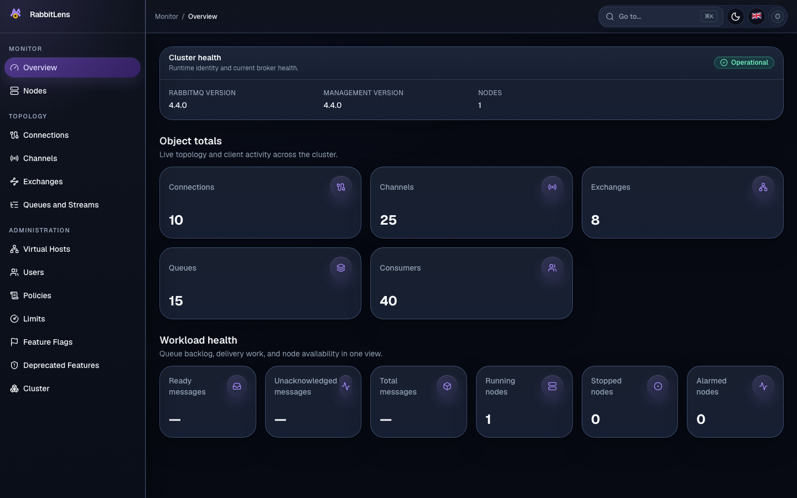

<p align="center">
  
</p>

<h1 align="center">RabbitLens</h1>

<p align="center">A focused, modern RabbitMQ Management UI.</p>

<p align="center">
  <a href="https://github.com/huynhanx03/RabbitLens/actions/workflows/rabbitlens.yml"></a>
  <a href="LICENSE"></a>
  
  
</p>

<p align="center">
  Monitor topology, operate safely, and manage RabbitMQ from one fast, accessible workspace.
</p>



RabbitLens is a replacement browser UI for RabbitMQ Management. It uses the proven
RabbitMQ Management HTTP API while providing a more focused workflow for monitoring
brokers, managing topology, and handling administrative work safely.

## Why RabbitLens

RabbitMQ remains the source of truth for authentication, permissions, topology, and
messages. RabbitLens is the operator workspace on top: modern, keyboard-accessible,
localized in English and Vietnamese, and built for both day-to-day operations and
production rollouts.

- Monitor cluster health, nodes, connections, channels, queues, exchanges, and rates.
- Operate safely with permission-aware navigation and deliberate destructive actions.
- Manage users, virtual hosts, policies, limits, feature flags, and definitions.
- Use supported extension surfaces including federation, shovels, streams, tracing, and top.
- Run a lightweight static frontend with an nginx `/api` proxy; RabbitLens stores no broker data.

## Architecture

```text
Browser → RabbitLens SPA → /api proxy → RabbitMQ Management HTTP API → Broker
```

RabbitMQ must have the `rabbitmq_management` plugin enabled. RabbitLens does not
replace RabbitMQ, bypass its authorization model, or persist message payloads.

## Quick start

The demo stack starts RabbitMQ and RabbitLens together:

```sh
make up
```

Open <http://127.0.0.1:8080> and sign in with `admin` / `rabbitlens-demo`.

Useful demo commands:

```sh
make seed    # Populate the demo broker with messages
make smoke   # Verify the running demo stack
make logs    # Follow service logs
make down    # Stop the stack
```

## Deploy with an existing RabbitMQ

RabbitLens can run independently and proxy to an existing Management API. Copy the
example configuration, set the RabbitMQ host and a pinned image tag, then start it:

```sh
cp deploy/.env.example deploy/.env
docker compose --env-file deploy/.env -f deploy/compose.yaml pull
docker compose --env-file deploy/.env -f deploy/compose.yaml up -d --no-build
```

For Docker Desktop, `host.docker.internal` reaches a broker on the host machine.
For a remote broker, set `RABBITMQ_MANAGEMENT_HOST` in `deploy/.env`. Put RabbitLens
behind HTTPS in production and keep the raw RabbitMQ Management port private whenever
possible. See [the deployment guide](deploy/README.md) for updates, rollback, and
network examples.

## Development

Requirements: Node.js 22+, npm, Docker, and Docker Compose.

```sh
npm --prefix website ci
make dev
```

The Vite server uses the runtime configuration at
[`website/public/runtime-config.json`](website/public/runtime-config.json). The demo
stack is the easiest local Management API target; start it with `make up` before
working through authenticated flows.

| Command                                  | Purpose                                                                     |
| ---------------------------------------- | --------------------------------------------------------------------------- |
| `npm --prefix website run check`         | Format, lint, typecheck, ownership checks, unit tests, and production build |
| `npm --prefix website run test:coverage` | Full production coverage report                                             |
| `npm --prefix website run test:e2e`      | Playwright flows across Chromium, Firefox, WebKit, and mobile profiles      |
| `npm --prefix website run check:bundle`  | Enforce initial and lazy-load bundle budgets                                |
| `npm --prefix website run audit`         | Fail on high-severity dependency vulnerabilities                            |

## Quality and CI

Every pull request runs a clear set of independent gates after validation:

- **Validate** — formatting, linting, TypeScript, and production-test ownership.
- **Test** — coverage for the files changed by the pull request; the gate is 85%.
- **Build** — production build, bundle budgets, and dependency audit.
- **Browser** — end-to-end, accessibility, responsive, performance, and artifact-secret tests.

Parity against a pinned RabbitMQ Management UI source runs on `main` and on manual
dispatches. This keeps pull requests quick without losing an authoritative
compatibility check.

## Security

Browser users authenticate directly against RabbitMQ. Do not put RabbitMQ credentials
or OAuth client secrets in the frontend runtime configuration. Report vulnerabilities
privately through [GitHub Security Advisories](https://github.com/huynhanx03/RabbitLens/security/advisories/new);
please do not open a public issue with exploit details. See [SECURITY.md](SECURITY.md)
for the reporting process.

## Compatibility

RabbitLens is verified against RabbitMQ `4.3.2-management` and the Management HTTP
API. For a production rollout, pin a RabbitLens release image, export RabbitMQ
definitions first, and validate access with a non-administrator account before
switching operators over.

## Documentation

- [Architecture](docs/architecture.md)
- [Code standards](docs/code-standards.md)
- [Design system](docs/design-system.md)
- [Testing strategy](docs/testing-strategy.md)
- [Contributing](docs/contributing.md)

## Contributing

Issues and focused pull requests are welcome. Please use conventional commit messages,
keep each change reviewable, add or update the relevant tests, and run
`npm --prefix website run check` before opening a pull request. The complete workflow
is in [CONTRIBUTING.md](CONTRIBUTING.md).

## License

RabbitLens is licensed under [Apache-2.0](LICENSE).
